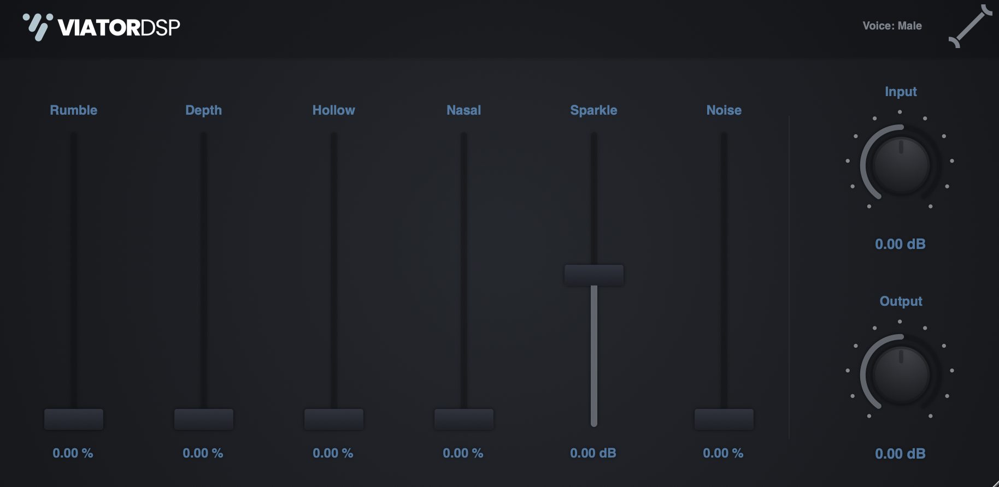

## Hermes Voice EQ
Introducing Hermes Voice EQ—a fresh and innovative approach to graphic equalizers designed specifically for streamers, podcasters, and individuals seeking to enhance the quality of their voice. With Hermes Voice EQ, you can effortlessly achieve professional audio results without requiring extensive knowledge of audio engineering or complex audio plugins.

### Quick Links
- Latest Mac Builds
    - AU [Build](https://github.com/landonviator/Hermes-Vocal-EQ/blob/main/HermesVoiceEQ/Builds/MacOSX/build/Release/Hermes%20Voice%20EQ.component)
    - VST3 [Build](https://github.com/landonviator/Hermes-Vocal-EQ/blob/main/HermesVoiceEQ/Builds/MacOSX/build/Release/Hermes%20Voice%20EQ.vst3)

Windows builds are not yet available, plugin is still development.

## Description

Hermes Voice EQ is a 6-band eq geared towards non-audio enthusiasts who want to make their voice sound better. We understand that technical jargon can be daunting, so we've made it easy for you. When you hover over each band, a simple and concise description appears, explaining the purpose of the control in plain language. For example, the "Nasal" slider reduces nasal-like frequencies to open up your voice. With Hermes Voice EQ, you don't need to worry about the technical details—everything is clearly described for you.

Unlock the power of your voice with Hermes Voice EQ—effortlessly enhance its quality and make it shine. Whether you're a streamer, podcaster, or someone who wants their voice to sound better, our intuitive interface and user-friendly controls make the process a breeze.

Additionally, the plugin features input and output dials that facilitate the management of signal volumes entering and exiting the system. This functionality enables users to address any volume fluctuations caused by the equalizer or make adjustments to suit streaming requirements. Furthermore, a male/female button is available to modify the center frequencies associated with different voice types. Lastly, a settings pane grants users the ability to enable or disable tooltips, customize color themes, and access links to my social media platforms.

## Contributing
Contributions to the Hermes Voice EQ is welcome and encouraged. There are many ways to contribute to this project, for both programmers and non-programmers. Ways to contribute:

#### Testing 
The easiest way to contribute is to use the plugin in any way you want! All software has bugs and glitches. The more the plugin gets used, the quicker bugs will be found and fixed. There are different DAWs and hosts that can all have different behavior, causing different bugs. Plus, this will hopefully be used in non-DAW software such as Elgato WaveLink, so there are bound to be extra things to consider.

#### Presets
If you find some amazing presets for different voice types or situations, we'd love to include them. A way to upload presets will be made in the future.

#### Plugin Development
If you'd like to contribute to the development of the plugin, great! Start with the issues page. If there are no bugs and you'd like to introduce a new feature, fine-tune some of the DSP, or anything else, submit a PR and it will be reviewed.

## Support
If you like my work and would like to support me creating more audio applications, check out my [Patreon](https://www.patreon.com/ViatorDSP) where you can donate and download all of my current plugins!

## Online Presence:
- I stream JUCE development on [YouTube](https://www.youtube.com/channel/UCwEc_CsAk3ky7sX_yg6bSSg)
- [Patreon](https://www.patreon.com/ViatorDSP)  
- Join my [Discord](https://discord.gg/PgU3Dd8vxJ) server!

## License
MIT License

Copyright (c) 2023 Landon

Permission is hereby granted, free of charge, to any person obtaining a copy
of this software and associated documentation files (the "Software"), to deal
in the Software without restriction, including without limitation the rights
to use, copy, modify, merge, publish, distribute, sublicense, and/or sell
copies of the Software, and to permit persons to whom the Software is
furnished to do so, subject to the following conditions:

The above copyright notice and this permission notice shall be included in all
copies or substantial portions of the Software.

THE SOFTWARE IS PROVIDED "AS IS", WITHOUT WARRANTY OF ANY KIND, EXPRESS OR
IMPLIED, INCLUDING BUT NOT LIMITED TO THE WARRANTIES OF MERCHANTABILITY,
FITNESS FOR A PARTICULAR PURPOSE AND NONINFRINGEMENT. IN NO EVENT SHALL THE
AUTHORS OR COPYRIGHT HOLDERS BE LIABLE FOR ANY CLAIM, DAMAGES OR OTHER
LIABILITY, WHETHER IN AN ACTION OF CONTRACT, TORT OR OTHERWISE, ARISING FROM,
OUT OF OR IN CONNECTION WITH THE SOFTWARE OR THE USE OR OTHER DEALINGS IN THE
SOFTWARE.
